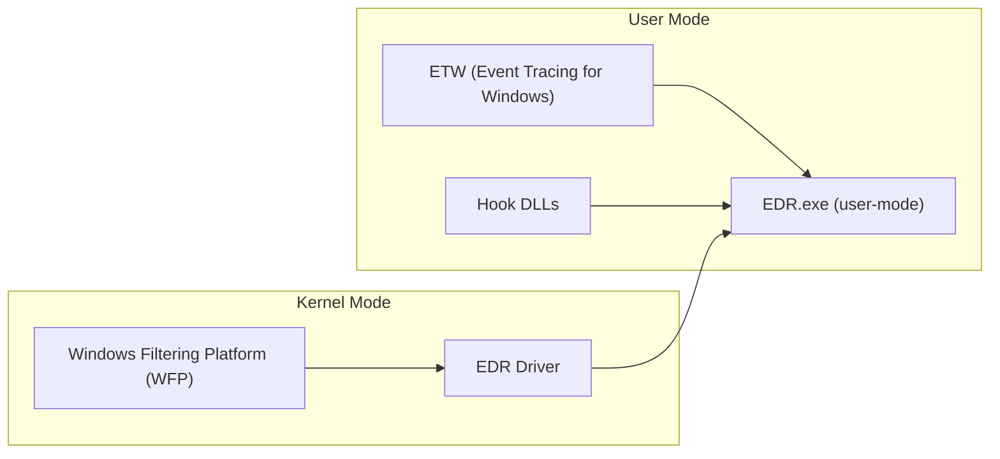
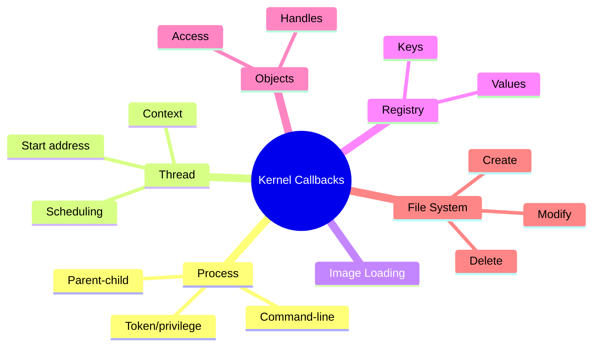
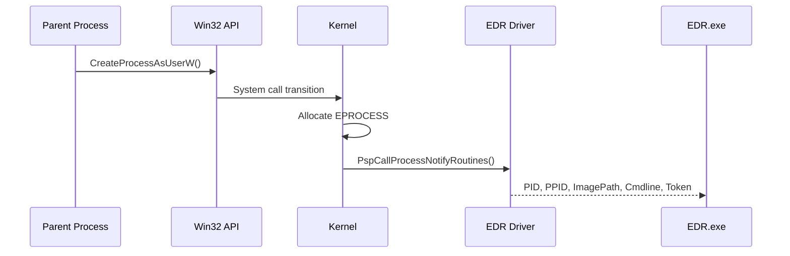
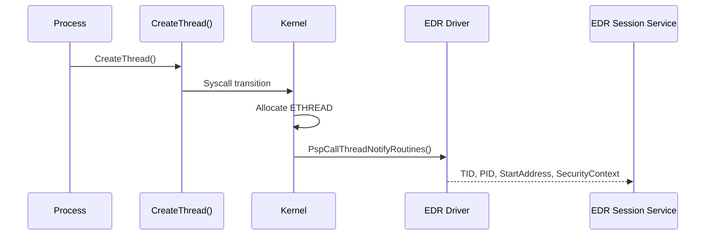
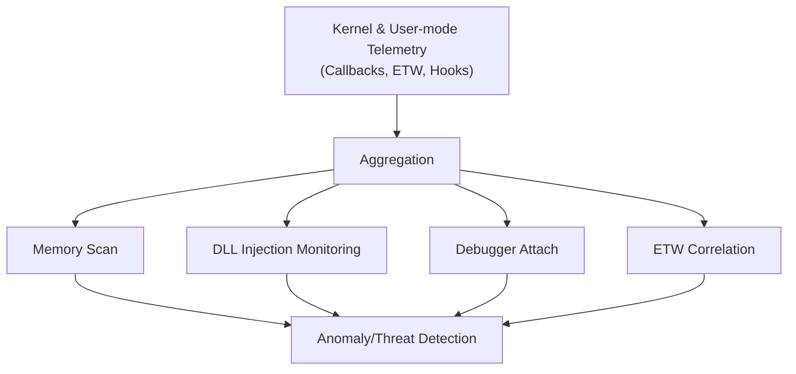
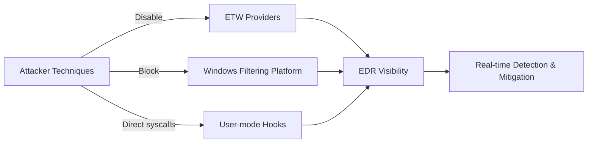

---

title: "EDR Internals Architecture Overview"
date: 2025-11-09 10:00:00 -0700
categories: [security, edr]
tags: [edr, windows, kernel, etw, wfp]
mermaid: true
---

* The EDR architecture is designed to collect telemetry from both **user mode** and **kernel mode**, enabling comprehensive system monitoring and threat detection.
* Main components include:

  * **ETW (Event Tracing for Windows)**: Provides system-wide telemetry for activities such as process creation, image loading, network communication, and memory allocation. EDR processes consume ETW events in real time.
  * **Hook DLLs**: Injected into user-mode processes to intercept sensitive API calls and forward telemetry to the EDR for analysis. Attackers may evade these hooks using direct system calls or unhooking.
  * **Network Filters**: Implemented via the **Windows Filtering Platform (WFP)** to monitor network traffic at the kernel level. Attackers may exploit WFP to block EDR traffic.
  * **EDR Driver**: Operates in kernel mode, intercepting low-level events via kernel callbacks to monitor processes, threads, registry operations, objects, and file system activities.

# Kernel Callbacks and Telemetry Sources

* Kernel callbacks provide deep visibility into system behavior by tracking:

  * **Process Creation**
  * **Thread Creation**
  * **Image Loading**
  * **Registry Changes**
  * **Objects Access**
  * **File System Activities**
* Each callback category contributes different types of telemetry:

  * **Process Telemetry**: Command-line details, parent-child process relationships, and privilege levels.
  * **Thread Telemetry**: Thread context, scheduling, and execution details.
  * **Registry Telemetry**: Modifications to keys and values.
  * **Object Telemetry**: Handle interactions and access requests.
  * **File System Telemetry**: File creations, modifications, and deletions.

# Process Creation Kernel Callbacks

* These callbacks are triggered when a process is created or terminated, allowing EDR drivers to collect telemetry in real-time.
* Callbacks are registered via kernel APIs like:

  * `PsSetCreateProcessNotifyRoutine`
  * `PsSetCreateProcessNotifyRoutineEx`
  * `PsSetCreateProcessNotifyRoutineEx2`
* The callback routines are stored in the kernel array **PsCreateProcessNotifyRoutine**, each entry pointing to a registered driver routine.
* Typical process creation flow:

  * A parent process calls the **Win32 API** `CreateProcessAsUserW`, transitioning from user mode to kernel mode.
  * The kernel allocates an **EPROCESS structure** for the new process.
  * The kernel function `PspCallProcessNotifyRoutines` iterates through registered callbacks, triggering EDR routines.
  * The EDR driver collects telemetry such as:

    * Process and parent process IDs
    * Image path of the executable
    * Command-line arguments
    * Security token information
* The collected data is sent to the EDR user-mode process (**EDR.exe**) for analysis or stored in ETW sessions.
* Example drivers registering process callbacks include **WdFilter.sys** (Windows Defender) and **MsSecFlt.sys** (Microsoft Defender for Endpoint).

# Thread Creation Kernel Callbacks

* Triggered whenever a thread is created or terminated, enabling fine-grained telemetry on thread activity.
* Registered via kernel APIs such as:

  * `PsSetCreateThreadNotifyRoutine`
  * `PsSetCreateThreadNotifyRoutineEx`
* Registered callback routines are maintained in the kernel array **PsCreateThreadNotifyRoutine**.
* Thread creation flow:

  * A process calls the **API** `CreateThread`, transitioning from user mode to kernel mode.
  * The Windows process manager allocates an **ETHREAD structure** for the new thread.
  * The kernel function `PspCallThreadNotifyRoutines` iterates through registered callbacks.
  * The EDR callback collects telemetry including:

    * Thread ID and process ID
    * Thread start address
    * Security context
* The telemetry is sent to the EDR session service for real-time processing and behavioral monitoring.
* Example drivers observed with thread callbacks are **WdFilter.sys** and **MsSecFlt.sys**.

# Telemetry Analysis and Threat Detection

* EDR processes in user mode aggregate telemetry from different sources and perform analysis to detect anomalies.
* Common analysis steps include:

  * Scanning process memory for malware patterns.
  * DLL injection for API call monitoring.
  * Attaching debuggers to observe runtime behavior.
  * Correlation with ETW events for comprehensive context.

# Security Considerations

* Attackers may attempt to disable or bypass EDR telemetry sources through:

  * Disabling ETW providers.
  * Blocking network traffic using WFP.
  * Employing direct system calls to evade hooking.
* Kernel callbacks and ETW-based telemetry provide EDRs with resilient visibility at both system and process levels, essential for identifying and mitigating malicious activities in real time.

