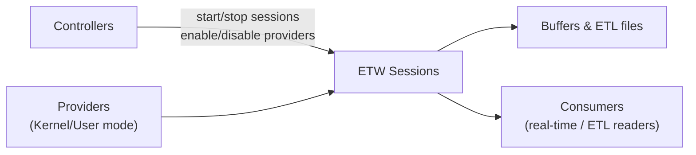
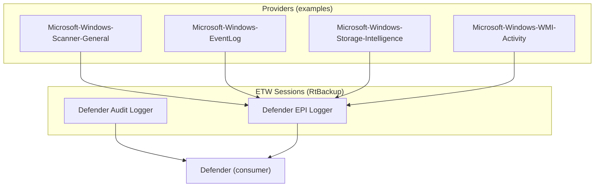
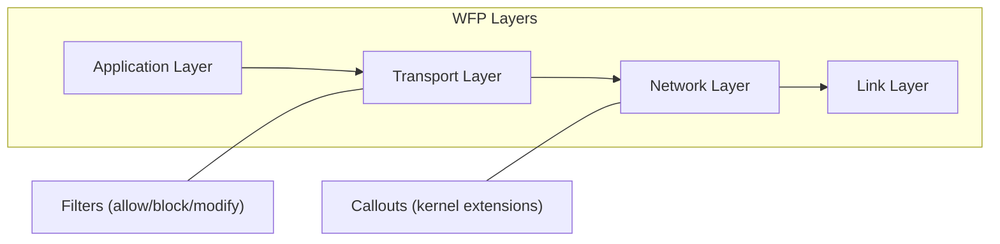
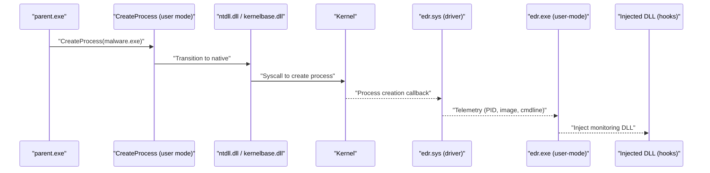
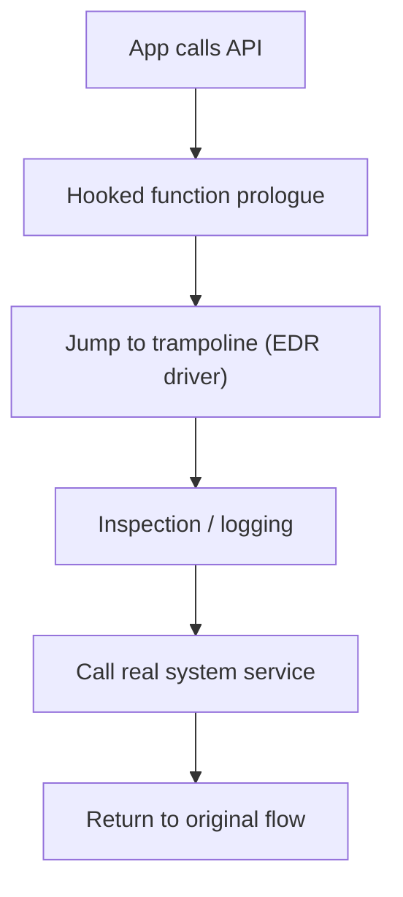

---

title: "EDR Telemetry Collection and Architecture"
date: 2025-11-09 11:00:00 -0700
categories: [security, edr]
tags: [edr, windows, etw, wfp, hooking]
mermaid: true
---

* The session covered endpoint detection and response (EDR) telemetry collection, focusing on Event Tracing for Windows (ETW) architecture and its role in telemetry gathering.
* ETW architecture consists of three main components: controllers, providers, and consumers.

  * **Controllers** manage ETW sessions by starting or stopping event collection and enabling or disabling ETW providers.
  * **Providers** act as event sources generating telemetry based on system or application activity. They can operate in either kernel mode (tracking process creation, file system operations, registry changes) or user mode (monitoring application-level events).
  * **Consumers** are applications or tools that process events, either in real time or by reading ETL (Event Trace Log) files stored on disk.
* ETW sessions handle the collection, buffering, and storage of event data. Each session keeps multiple buffers to temporarily store events, and multiple sessions can run simultaneously for different providers.
* Events generated may stay in memory buffers for real-time analysis or be logged into ETL files for later investigation.

# Windows Defender and ETW Integration

* Windows Defender uses ETW to collect security telemetry through two ETW sessions:

  * **Defender Audit Logger**
  * **Defender EPI Logger**
* Both sessions are located under `C:\Windows\System32\LogFiles\WMI\RtBackup`.
* The **Defender EPI Logger** session is associated with several ETW providers, including:

  * Microsoft-Windows-Scanner-General
  * Microsoft-Windows-EventLog
  * Microsoft-Windows-Storage-Intelligence
  * Microsoft-Windows-WMI-Activity
* These providers generate telemetry relevant to system events, network behaviors, and endpoint protection interactions.
* Defender consumes this telemetry in real time to detect malicious behaviors, identify suspicious activities, and improve threat detection.
* Security researchers use this data to understand Defender’s detection mechanisms, while attackers may attempt to evade by disabling providers or stopping ETW sessions.

# Network Telemetry via Windows Filtering Platform (WFP)

* **Windows Filtering Platform (WFP)** is used to monitor and filter network traffic across logical layers of the network stack.
* Each layer contains IPv4 and IPv6 components that define specific network data fields.
* **Filters and callouts** are used to control traffic:

  * Filters apply conditions to network requests to allow, block, or modify traffic.
  * Callouts are optional kernel callbacks that extend filtering functionality.
* EDR solutions leverage WFP to inspect packets, track connections, and detect abnormalities such as command-and-control (C2) communications, data exfiltration, or suspicious file transfers.

# Process Monitoring and API Hooking

* EDR systems monitor process creation to collect detailed execution telemetry.
* Flow example:

  * A parent process (`parent.exe`) creates a new process (`malware.exe`).
  * The `CreateProcess` API in user mode transitions to kernel mode through `ntdll.dll` and `kernelbase.dll`.
  * The Windows kernel executes registered process creation callbacks.
  * The EDR driver (`edr.sys`) receives a callback, collects process metadata, and forwards it to the user-mode EDR process (`edr.exe`).
* To monitor system behavior, the EDR injects a DLL into the newly created process for API hooking.
* Inline hooking alters normal syscall execution by redirecting flow through a trampoline function in the EDR driver before calling the actual system service, allowing for inspection and logging of suspicious activity.
* After performing necessary checks, the hook function restores the legitimate execution path and completes the system call if no threat is detected.

# Advanced Detection and Response Mechanisms

* Modern EDRs employ multiple detection mechanisms to enhance protection:

  * AI and machine learning–based anomaly detection to identify suspicious behavioral patterns.
  * **Cloud submission and scanning** for deep analysis using cloud-based intelligence.
  * **YARA rule and signature-based scanning** to detect known malware patterns in files or memory.
  * **Threat hunting automation** for continuous scanning of indicators of compromise (IOCs).
  * **Sandboxing** to safely execute and analyze potentially malicious files.
  * **Deception technology** employing decoy files, fake credentials, and honey tokens to detect intrusions.
  * **Exploit mitigation** through stack integrity checks and memory protection techniques to block common exploitation methods.
