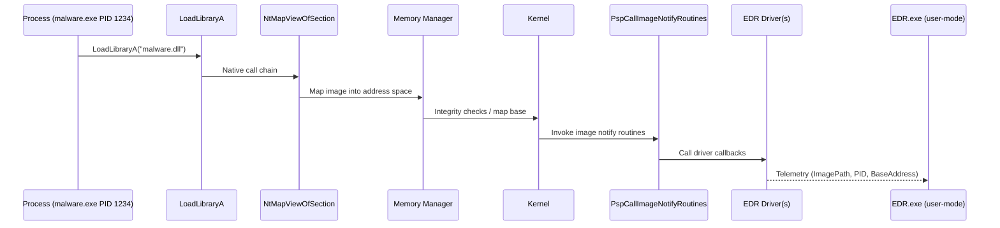
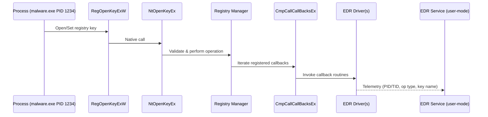

---

title: "Image Load & Registry Operation Kernel Callbacks"
date: 2025-11-09 10:20:00 -0700
categories: [security, edr]
tags: [edr, windows, kernel, callbacks, image-load, registry]
mermaid: true
---------

* Image Load Kernel Callbacks are low-level routines in the Windows kernel triggered whenever a Portable Executable (PE) image—such as `.exe`, `.dll`, or `.sys`—is loaded into memory.
* Their main function is to notify registered drivers about image loading events, enabling monitoring and telemetry collection for image execution.
* These callbacks are essential to Endpoint Detection and Response (EDR) systems to detect malicious techniques like reflective DLL injection, unsigned driver loading, and process hollowing.
* Key metadata collected includes:

  * Full image name
  * Process ID of the process loading the image
  * Base address and memory mapping details
* Callbacks are stored in an internal kernel array `PspLoadImageNotifyRoutine`. Each array entry points to a driver-registered callback routine.
* When a PE file is mapped into memory (via system calls such as `NtMapViewOfSection` or `LdrLoadDll`), the kernel iterates through this array to invoke each registered callback and pass image load information.
* Drivers register these callbacks using kernel APIs:

  * `PsSetLoadImageNotifyRoutine`
  * `PsSetLoadImageNotifyRoutineEx`
* The BCMBD (open-source driver) example demonstrates enumerating callback routines from `PspLoadImageNotifyRoutine` to collect details like:

  * Driver name (e.g., `WdFilter.sys`, `MsSecFlt.sys`)
  * Callback function address
* Example execution flow:

  * A process (`malware.exe`, PID 1234) loads a module (`malware.dll`) using `LoadLibraryA`.
  * This call chains through system-level APIs to `NtMapViewOfSection`, triggering a transition from user mode to kernel mode.
  * The Windows Memory Manager maps the image into the process address space, verifies integrity, and invokes `PspCallImageNotifyRoutines`.
  * Callback routines from registered drivers (e.g., EDR solutions) are executed, collecting telemetry (image path, process ID, base address).
  * The telemetry is passed to the EDR driver and subsequently to the user-mode EDR process for analysis and active monitoring of the process and loaded modules.
* These steps enable EDR solutions like Windows Defender and Microsoft Defender for Endpoint to monitor image load events in real time and detect malicious activity promptly.

```mermaid
%% Image load callbacks: registration and dispatch
flowchart LR
  A[Drivers] -->|register| B[PsSetLoadImageNotifyRoutine / Ex]
  B --> C[PspLoadImageNotifyRoutine (array)]
  D[PE mapped (NtMapViewOfSection / LdrLoadDll)] --> E[PspCallImageNotifyRoutines]
  E --> C
  C --> F[Driver callbacks invoked]
```



# Registry Operation Kernel Callbacks

* Registry Operation Kernel Callbacks are routines triggered by registry actions such as read, write, delete, or query operations.
* They inform registered drivers of registry modifications for telemetry and behavioral analysis.
* Commonly utilized by EDR systems to detect malicious persistence, privilege escalation, and unauthorized registry manipulations.
* These callbacks reside in a doubly linked list headed by `CallbackListHead` in the kernel, with each node referencing a registered callback function.
* They are triggered when registry modification system calls occur (e.g., `NtOpenKeyEx`, `NtSetValueKey`).
* Drivers can register callbacks via:

  * `CmRegisterCallback`
  * `CmRegisterCallbackEx`
* In the BCMBD driver example, the driver enumerates callback routines stored in `CallbackListHead` and gathers:

  * Driver identifier (e.g., `WdFilter.sys`, `MsSecFlt.sys`)
  * Callback function addresses
* Example execution flow:

  * A process (`malware.exe`, PID 1234) initiates a registry modification for persistence or configuration.
  * The call to `RegOpenKeyExW` triggers a native API transition to `NtOpenKeyEx`, invoking a system call to kernel mode.
  * The Windows Registry Manager processes the request, validates permissions, and executes `CmpCallCallBacksEx`.
  * This function iterates through the list of registered callbacks, triggering each routine.
  * EDR callback routines collect telemetry, including:

    * Process ID and thread ID
    * Type of operation (read, write, delete)
    * Registry key name
  * Captured telemetry is transmitted to the EDR service for real-time analysis.
  * EDR solutions leverage this telemetry to detect and respond to unauthorized registry changes, persistence attempts, or escalation behaviors.

```mermaid
%% Registry callbacks: registration and list structure
flowchart LR
  A[Drivers] -->|register| B[CmRegisterCallback / Ex]
  B --> C[CallbackListHead (doubly linked list)]
  D[Registry syscalls (NtOpenKeyEx, NtSetValueKey,...)] --> E[CmpCallCallBacksEx]
  E --> C
  C --> F[Driver callbacks invoked]
```



# Key Takeaways

* **Image Load Callbacks** enable real-time tracking of image loads to detect in-memory execution attacks.
* **Registry Callbacks** offer continuous visibility into registry activities critical for detecting persistence and tampering.
* Both callback mechanisms underpin EDR telemetry pipelines, bridging kernel-level events and user-mode analysis for comprehensive endpoint protection.
