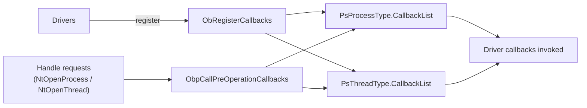
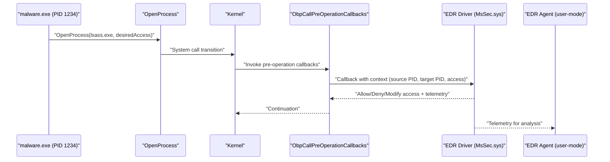
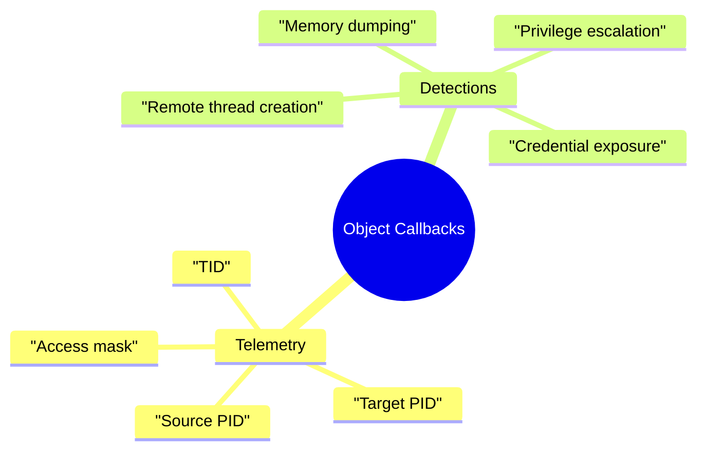
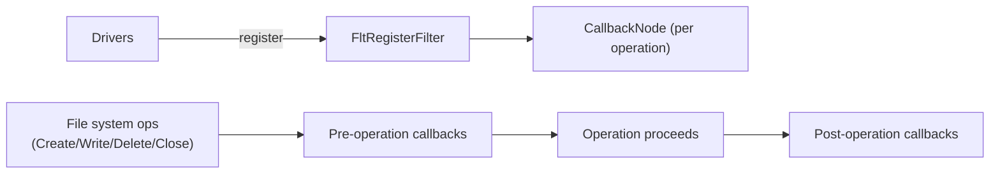
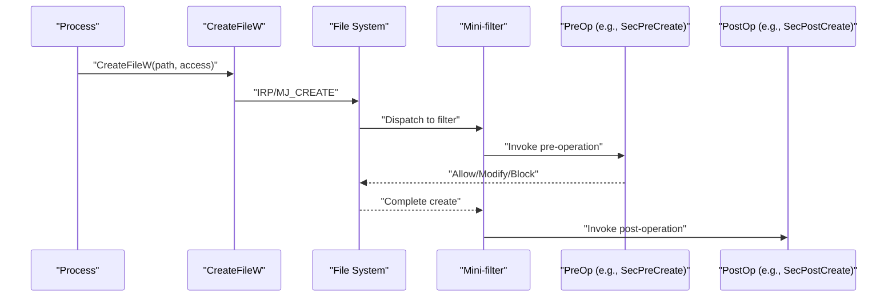
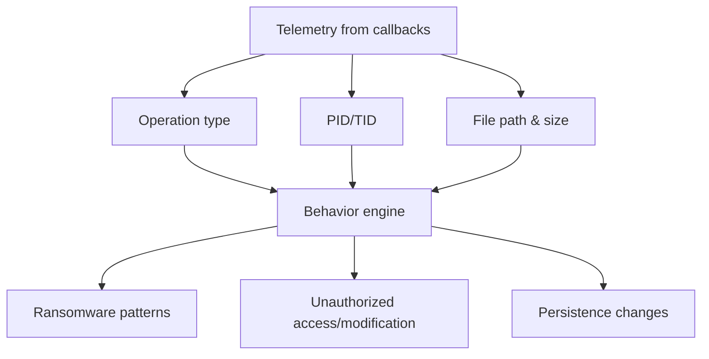

---

title: "EDR Internals: Object Operation and File System Kernel Callbacks"
date: 2025-11-09 10:40:00 -0700
categories: [security, edr]
tags: [edr, windows, kernel, callbacks, object, filesystem]
mermaid: true
---

# Object Operation Kernel Callbacks

* These are low-level routines in the Windows kernel triggered when a **process or thread handle** is created, duplicated, or modified.
* Their core purpose is to notify **registered drivers** about object-related operations, enabling drivers to monitor and collect telemetry on suspicious handle access events.
* Widely used by **Endpoint Detection and Response (EDR)** systems to detect malicious handle operations, including:

  * Memory dumping for credential theft.
  * Remote thread creation for process injection and remote code execution.
* Callbacks are maintained in a **doubly linked list**, specifically `PsProcessType.CallbackList` or `PsThreadType.CallbackList`.
  Each entry in this list corresponds to a registered callback routine.
* The kernel iterates through this list when a handle event occurs, invoking all registered callbacks and passing event information such as process, thread, and access details.
* User-mode handle requests (e.g., via `NtOpenProcess`, `NtOpenThread`) trigger these kernel-level callbacks.

# Registration and Behavior

* Drivers register their callbacks using the **kernel API** `ObRegisterCallbacks`.
* This registration enables monitoring and restriction of access to process and thread objects, critical for detecting unauthorized manipulations.
* Example:
  Using the **DCM open-source driver**, object operation callbacks can be enumerated to reveal telemetry including:

  * Registered driver name.
  * Driver identifier.
  * Address of the callback routine.
* Typical registered callback example:
  `MsSec.sys` (Microsoft Defender for Endpoint) registers callbacks to **protect sensitive processes** (such as `lsass.exe`) by restricting external handle access.

# Example Execution Flow

* **Case Study:**

  * `malware.exe` (PID 1234) attempts to open a handle to `lsass.exe`.
  * The process invokes the **Win32 API** `OpenProcess`, which transitions to **kernel mode** through a system call.
  * The kernel executes `ObpCallPreOperationCallbacks`, invoking all registered pre-operation callbacks from the doubly linked list.
  * The EDR driver (`MsSec.sys`) uses pre-operation and post-operation callbacks to:

    * Monitor attempted access to protected processes.
    * Restrict handle creation or modification when access appears unauthorized.
* The EDR driver’s **pre-notify routine** collects telemetry such as:

  * Requesting process (source PID).
  * Target process (destination PID).
  * Requested access rights (e.g., `PROCESS_VM_READ` for memory access).
  * Thread ID initiating the operation.
  * Additional access flags for detection analysis.
* Collected telemetry is forwarded from the **EDR kernel driver** to the **user-mode EDR agent**, which continues analysis and active monitoring.

# Telemetry and Detection Capabilities

* Telemetry collected from object callbacks empowers detection of:

  * Unauthorized memory reading or dumping.
  * Remote code injection attempts.
  * Process handle abuse leading to privilege escalation or credential exposure.
* Key monitoring metrics include:

  * Process and thread identifiers.
  * Access rights and operation type.
  * Target object sensitivity (e.g., system processes).

# File System Operation Kernel Callbacks (Mini-Filters)

* Mini-filter kernel callbacks are triggered during **file system operations** such as create, write, delete, or close.
* These notify registered drivers about **file system activity**, enabling detection of potentially malicious or unauthorized actions.
* EDR solutions leverage these callbacks for:

  * Detecting ransomware behavior.
  * Identifying unauthorized file access or modification.
* Callbacks are tracked within a structure called `CallbackNode`, used by mini-filters to manage routine registration.

# Mini-Filter Registration and Execution

* Drivers register file system operation callbacks using the `FltRegisterFilter` API.
* Each filter can include:

  * **Pre-operation callbacks**: Executed before the file operation.
  * **Post-operation callbacks**: Executed after the file operation finishes.
* Example driver flow:

  * MDE (Microsoft Defender Endpoint) filter defines:

    * Pre-operation callback: `SecPreCreate`.
    * Post-operation callback: `SecPostCreate`.
* Mini-filter architecture supports multiple instances, enabling monitoring across different volumes or file systems, each managing its own set of callback nodes.

# File System Telemetry and Detection

* Each callback node collects telemetry related to the file operation type and context:

  * **Operation type**: Create, read, write, delete, rename.
  * **Performer’s PID and TID.**
  * **File path and size involved.**
* This telemetry enables:

  * Detection of **suspicious file modifications** such as unauthorized encryption or corruption.
  * Identification of **ransomware behavior** and credential dumping activities.
  * Monitoring persistence mechanisms that modify system or configuration files.

# Summary

* **Object Operation and File System Kernel Callbacks** are fundamental mechanisms supporting real-time kernel-level telemetry for threat detection.
* **EDR systems** rely on these callback structures to monitor both process handle and file system activities, allowing for immediate defensive responses to unauthorized or malicious actions.
* Through pre- and post-operation routines, EDR drivers can protect sensitive processes, restrict file access, and enrich security telemetry essential for modern endpoint protection.
